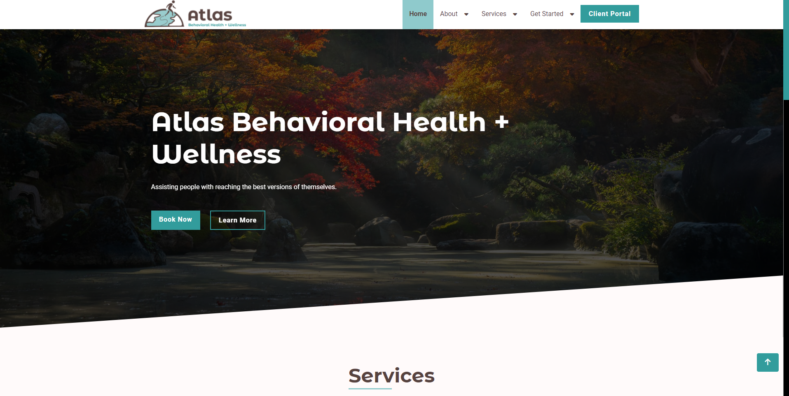
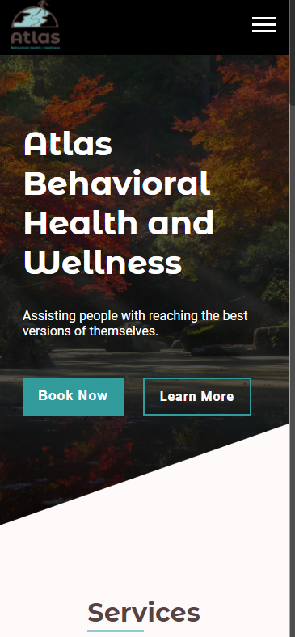

# Freelance Template 1

- [Description](#description)
  - [Built With](#built-with)
  - [Screenshots](#screenshots)
  - [Links](#links)
- [My process](#my-process)
  - [Challenges](#challenges)
- [Author](#author)

## Description

This is a multi-page static website that I built for Atlas Behavioral Health + Wellness, a mental health private practice based in North Chesterfield, Virginia. They are in the process of opening their private practice and were in need of a website to attract new clients, allow new and existing clients to schedule appointments as well as offer information about their company.

### Built With
- Html
- Css
- JavaScript

### Screenshots

### Links

- Live Site URL: [https://artsycoder533.github.io/atlas-/](https://artsycoder533.github.io/atlas-/)
- Repository URL: [https://github.com/artsycoder533/atlas-.git](https://github.com/artsycoder533/atlas-.git)
- Video Demo on Youtube: 

## My Process

I scheduled a consultation with the prospective client to gain information about what information they wanted on their style, the style, and number of pages.  After our phone call I sent a follow up email with all the information needed as they did not yet have the answers to all of my questions.  To start the website, I used a template I previously created to speed up my workflow.  The template I used can be found here https://artsycoder533.github.io/freelance-template1/ After that I was able to quickly add additional pages as well as transform the navbar to include submenus. The client did not have a particular design they wanted and were still waiting on their logo to be created so I created css variables to be able to easily change colors once they had their branding. I reused sections as much as possible as some pages have pretty much the same layout, just different text content. When I would add something to the website, I kept the client informed and sent a link to the live site hosted on my GitHub so they could offer feedback along the way.  Once the website was hosted I sent the client the link and they were satisfied with my work.  They still are in the process of getting a phone number and fax number for their business so in the mean time that information is listed as "TBD" on their website.

### Challenges 

One of the challenges I faced was determining if a user was on mobile or desktop as to how how the submenu should behave.  On mobile the submenus should be clicked to reveal the inner links, while on desktop the inner links should be visible on hover.  I used the outer width property on the window object to check for the size of the screen.  Depending on the size event listeners were added/removed for the links with the caret icon.  Another issue I faced was having to work around the logo image for the navbar.  The logo in the footer I was given with a transparent background, while the logo that is currently in the header had a white background instead of transparent. To work around this I had to tweak the header size and change the header background color to white to match, because the original header background color was black.  Due to having to account for HIPPA compliance, instead of a regular contact form the client used Hushmail.  Hushmail is a 3rd party service that offers secure email accounts as well as web forms.  They allow you to create a custom web form, however there werent any styling options, the only thing you could control was the background color.  Since you werent able to change the width of the form or the text color, it just did not look quite right against the brown background of the contact section.  To remedy this, rather than embedded the hushmail contact form directly on the web page I decided to link to the web version of the form, via a "Send us a secure message" button. Last, the last challenge I faced was when I initially tried to host the website.  I received an error on Netlify saying that the domain name I was trying to connect to Netlify was also being served on a the same server that Netlify uses.  I did a quick google search and I found a forum that addressed this specific issue with Name.com, where the client bought their domain.  The solution suggested that you first have to delete all the name servers and then try to link the domain name to Netlify.  Once I did this I was able to connect and the website was hosted.

## Author
Portfolio: [https://natashajohnson.dev/](https://natashajohnson.dev/)
